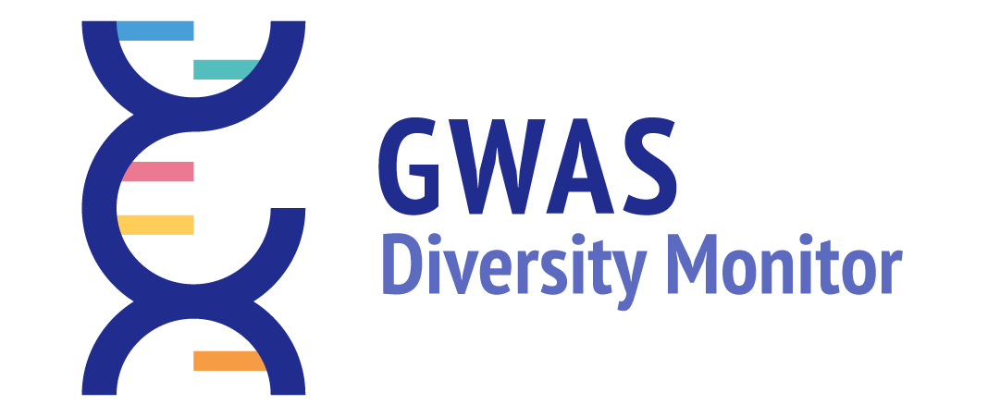

<p align="left">
  
</p>

[](https://zenodo.org/badge/latestdoi/220447592) [](https://shields.io/)  [](https://shields.io/)  [](https://shields.io/)

### Introduction

This is a repository to accompany the GWAS Diversity Monitor, currently maintained as part of the [Leverhulme Centre for Demographic Science](http://www.demographicscience.ox.ac.uk/). The dashboard can be found at:

<div align="center"> <a href="http://www.gwasdiversitymonitor.com">gwasdiversitymonitor.com</a></div>
<br/>

The frontend is written in [D3 4.0](https://devdocs.io/d3~4/) (a JavaScript library for visualizing data with HTML, SVG, and CSS) with the backend hosted in [Flask](https://github.com/pallets/flask) (a lightweight WSGI web application framework written in Python). Grateful attributions regarding data are made to the [**EMBL-EBI GWAS Catalog**](https://www.ebi.ac.uk/gwas/). In summary, the dashboard visualizes a systematic interactive review of all GWAS published to date. This repo can be cloned and ran on-the-fly to generate a server on localhost as required. The dashboard and associated summary statistics check daily for updates from the Catalog and update with new releases. The cron adapts a couple of functions from our [Scientometric Review of all GWAS](https://www.nature.com/articles/s42003-018-0261-x)

### Prerequisites

As a pre-requisite to running this locally, you will need a working Python 3 installation with all of the necessary dependencies detailed in [requirements.txt](https://github.com/crahal/GWASDiversityMonitor/blob/master/requirements.txt) (generated by pipreqs). We strongly recommend virtual environments and [Anaconda](https://www.anaconda.com/distribution/).  

### Running the Code

To run: clone this directory, ``cd`` into the directory, download the data with "python generate_data.py", and serve the project by calling "python gwasdiversitymonitor.py". The launcher starts the Flask application behind Gunicorn, using production WSGI workers rather than Flask's development server. By default it binds to port 8000; set `GWAS_HOST`, `GWAS_PORT`, `GWAS_WORKERS`, `GWAS_THREADS`, or `GWAS_TIMEOUT` to override the server settings.

Data generation is staged under `data/.generate_data` and published only after every required raw, wrangled, JSON, and download artifact passes validation. If generation is interrupted after downloading the raw Catalog files, the next run reuses that validated raw snapshot and resumes the wrangling. Publication is coordinated with application reads, and a complete previous runtime snapshot remains available if publication itself is interrupted. A run is skipped as unchanged only when the raw-input fingerprints, generation parameters, implementation, static bundle, and complete published artifact manifest all match.

All funder resources live under `data/funders`. The hand-maintained `funder_cleaner.json` normalization map is version-controlled; `pubmed_grants.json`, `index.json`, `dashboards/`, and `downloads/` are generated. The cleaner is copied into each staged release and included in release validation and recovery snapshots.

The data image contains a copy of the generator code. After pulling a change to
`generate_data.py` or `funder_pipeline.py`, rebuild that image before starting
the data service; rebuilding only Flask and nginx does not refresh generated
reports. To rebuild just the funder reports from the existing PubMed cache:

```bash
docker-compose build data
docker-compose run --rm data python3 funder_pipeline.py --skip-fetch --repository /app
docker-compose restart flask
```

#### Data-generation failure email

Failure email is disabled by default and fails closed. It is considered only when `GWAS_DEPLOYMENT_DOMAIN` is set to exactly `gwasdiversitymonitor.com`, which must be done only in the ignored `.env` file on the canonical production server. Local, development, staging, test, cloned, and otherwise unmarked copies never open a mail connection.

On the canonical production server, an exception or interruption in `generate_data.py` emails a timestamped error and bounded traceback to `contact@gwasdiversitymonitor.com`. The data container hands the message, without authentication, to a loopback-only Postfix service on the Lightsail host. There is no email username, password, API key, or other mail secret in the application, Docker Compose, or `.env`.

Install the local mail transfer agent once on the production Lightsail instance:

```bash
sudo ./deploy/configure_failure_mail.sh
```

Then copy the example deployment marker, set `GWAS_DEPLOYMENT_DOMAIN=gwasdiversitymonitor.com`, and recreate the data service:

```bash
cp .env.example .env
chmod 600 .env
docker-compose up -d --build --force-recreate data
```

This is credential-free, but it is not anonymous: receiving systems need a verifiable sending host. Lightsail limits outbound port 25 by default. Attach a static IP, add an `A` record from `mail.gwasdiversitymonitor.com` to that IP, and ask AWS Support to remove the outbound mail quota and set matching reverse DNS, following the [Lightsail reverse-DNS procedure](https://docs.aws.amazon.com/lightsail/latest/userguide/amazon-lightsail-configuring-reverse-dns.html). Also authorize the static IP in the existing SPF record for the mail subdomain; update an existing record rather than publishing a second SPF record. No inbound SMTP firewall rule is needed for these outbound-only alerts.

The local relay is fixed to loopback and rejects any non-loopback relay setting. Multiple recipients can be supplied in `GWAS_FAILURE_EMAIL_TO` as a comma-separated list. Identical consecutive failures are limited to one message every six hours to prevent Docker's restart policy from flooding the inbox; a different error is sent immediately, and a successful run clears the cooldown. If Postfix cannot accept the message, the original generation failure and non-zero exit status are preserved and the alert-delivery error is recorded in `app/logging/diversity_logger.log`.

To do this run "python -m venv virtualenv" from the root of the project. This will create a directory called "virtualenv". Navigate into virtualenv/bin and run "pip install -r requirements.txt" to install the requirements of the project inside your new virtual environment. Then run the project from the root of the project (above the virtualenv/) with `./virtualenv/bin/python gwasdiversitymonitor.py`.

### Structure

The root of the folder contains routes.py, which is the main file which runs the application. This file registers paths inside the application, creates appropriate variables, and passes them into templates (html files) which renders the page. This is our Controller in an MVC framework.

Each call to @app.route('path') defines a path and almost all of these just return templates for pages. The exception is @app.route("/getCSV/<filename>") which is handling the data download for all cases and returns a file response.
The other exception in this file is, at the top, @app.context_processor. This injects shared functionality into the Flask templates, including browser information and the optional self-hosted GoatCounter URL.

The other important file here is DataLoader.py. This is a simple file containing a series of helper functions that route.py uses to load and reshape the data from the wrangled csv's into a shape that is workable with d3.

_Data_: pulls, wrangles and creates all data used in this project.

_Static_: This subfolder contains all of the assets for the application. CSS/Sass, fonts, images and js will all be found here. The one we care most about is the js. There is a script.js file which contains some global functions and then a file for each graph.

Each graph js file contains a function, which is then called from the global template, to instantiate the graph. The global filters recall these functions to redraw the graphs with the new filter state. "internal" filters, eg. year and parent term for each tile, are handled by event handlers inside each graph file.

### Docker Deployment

To launch the app using the Docker deployment, you must first install [Docker Compose](https://docs.docker.com/compose/install/).

The Docker deployment for this application uses four containers that are defined in `docker-compose.yml`:
1. **gwas_nginx:** An nginx web server
2. **gwas_flask:** The Flask web application running behind a gunicorn WSGI server (see `./deploy/flask.Dockerfile`)
3. **gwas_data:** The data-generation job (see `./deploy/data.Dockerfile`)
4. **gwas_goatcounter:** A self-hosted, cookie-free GoatCounter analytics service with a persistent SQLite volume

Production sets `GOATCOUNTER_URL` to `https://stats.gwasdiversitymonitor.com` by default. Set it to an empty value to disable analytics. The complete account creation, Lightsail distribution, DNS/TLS, deployment, backup, upgrade, and rollback procedure is in [deploy/GOATCOUNTER.md](deploy/GOATCOUNTER.md).

To launch the Docker containers from the command line: 
```angular2html
cd .../gwasdiversitymonitor
docker-compose up -d --build
```

You can check the status of active docker containers using:
```angular2html
docker ps
docker stats
```

While the containers are running, you can view the app from your web browser by navigating to [http://localhost:80](http://localhost:80).

To stop the containers, use:
```angular2html
docker-compose down
```

### Versioning

This dashboard is currently at Version 1.0.0 (with an article conditionally accepted Nature Genetics). During data generation, previously unseen combinations of known ancestry terms are classified automatically, recorded in `/data/support/dict_replacer_broad.tsv`, and synchronized into `data_static.zip` for the next run. The classifier can only use the existing `Broader` values from that dictionary. A combination containing a genuinely unknown component is left unclassified in `/data/unmapped/unmapped_broader.txt` for manual review rather than creating or guessing a new `Broader` type.

### License

This work is free. You can redistribute it and/or modify it under the terms of the MIT license, subject to the conditions regarding the data imposed by the [EMBL-EBI license](https://www.ebi.ac.uk/about/terms-of-use). The dashboard comes without any warranty, to the extent permitted by applicable law.

### Acknowledgements

We are grateful to the extensive help provided by [Global Initiative](https://www.global-initiative.com/) (and in particular to Jamie, Nynke, Veatriki, Alex, Lea and Quentin). Additional help and specific comments came from [Ian Knowles](https://github.com/ianknowles), [Yi Liu](https://github.com/YiLiu6240), [Jiani Yan](https://github.com/vallerrr), [Molly Przeworski](https://przeworskilab.com/), [Ben Domingue](https://github.com/ben-domingue), [Sam Trejo](https://cepa.stanford.edu/people/sam-trejo) and the [Sociogenome](http://www.sociogenome.org) group more generally.

### Future Versions

1. Additional tabs regarding funders, network analysis, and so forth.
